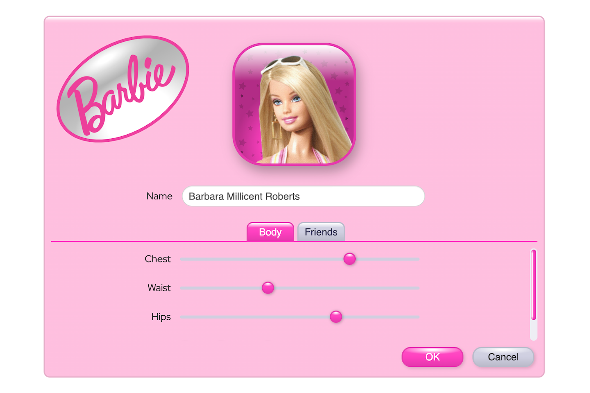

  

    
  

# SpecularCSS

[SpecularCSS](https://specularcss.org) is a set of CSS rules that allow you to add attractive material styling to your website. It is based upon a physical lighting model and is written in SASS. SpecularCSS has been designed to be easy to integrate into your website so you can make your website look Spectacular!

SpecularCSS allows you to create user interface elements using the following 5 material types:
 - [Flat](https://specularcss.org/#materials/flat)
 - [Chalk](https://specularcss.org/#materials/chalk)
 - [Plastic](https://specularcss.org/#materials/plastic)
 - [Glass](https://specularcss.org/#materials/glass)
 - [Metal](https://specularcss.org/#materials/metal)

## Technologies

SpecularCSS is created using the SASS css preprocessor.

## Documentation

Please visit the [documentation](https://specularcss.org/#docs) on the [SpecularCSS](https://specularcss.org) website.

## Examples

To view some of SpecularCSS's capabilities, you can view the following included demos:

Demo1

 

Demo2

 

Demo3

 

<!-- LICENSE -->
## License

Distributed under the MIT License. See `LICENSE` for more information.

<!-- CONTACT -->
## Contact

Abe Megahed - (mailto:amegahed@wisc.edu)