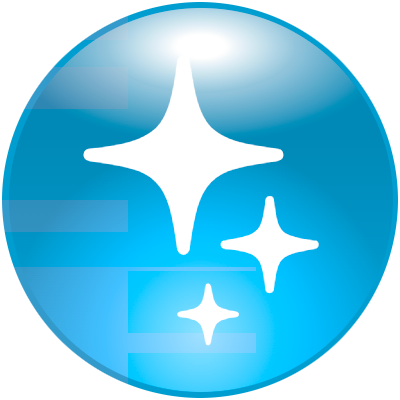

  

    
  

# SpecularCSS

[SpecularCSS](https://specularcss.sharedigm.com) is a set of CSS rules that allow you to add attractive material styling to your website. It is based upon a physical lighting model and is written in SASS. SpecularCSS has been designed to be easy to integrate into your website so you can make your website look Spectacular!

SpecularCSS allows you to create user interface elements using the following 5 material types:
 - [Flat](https://specularcss.sharedigm.com/#materials/flat)
 - [Chalk](https://specularcss.sharedigm.com/#materials/chalk)
 - [Plastic](https://specularcss.sharedigm.com/#materials/plastic)
 - [Glass](https://specularcss.sharedigm.com/#materials/glass)
 - [Metal](https://specularcss.sharedigm.com/#materials/metal)

## Technologies

SpecularCSS is created using the SASS css preprocessor.

## Documentation

Please visit the [documentation](https://specularcss.sharedigm.com/#docs) on the [SpecularCSS](https://specularcss.sharedigm.com) website.

## Demo

To view an interactive overview of SpecularCSS's capabilities, simply open up the file [demo/index.html](demo/index.html) in your web browser.

<!-- LICENSE -->
## License

Distributed under the MIT License. See `LICENSE` for more information.

<!-- CONTACT -->
## Contact

Abe Megahed - (mailto:amegahed@wisc.edu)